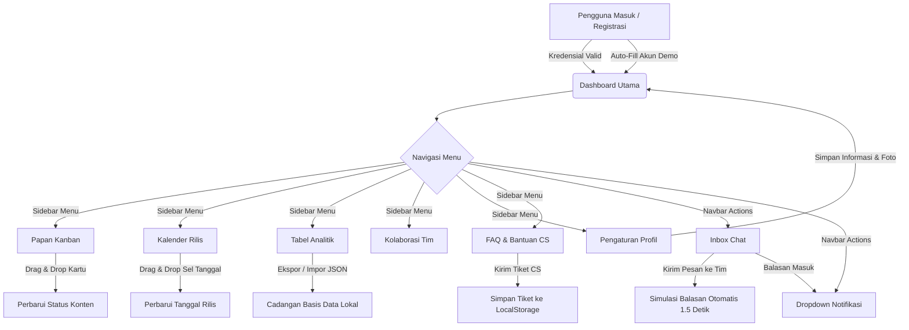

# Donezo - Platform Perencanaan & Kolaborasi Tim

Donezo adalah aplikasi web manajemen perencanaan konten dan kolaborasi tim terpadu yang dirancang dengan antarmuka modern, responsif, dan performa tinggi (offline-first berbasis IndexedDB dan LocalStorage). Aplikasi ini dilengkapi dengan transisi halaman yang halus, interaksi mikro interaktif, dan visualisasi data.

---

## 🗺️ Alur Aplikasi (Application Flow)

Berikut adalah diagram alur interaksi pengguna di dalam aplikasi Donezo:



---

## ✨ Fitur-Fitur Utama (Key Features)

### 1. Autentikasi Luring (Offline Authentication)
* Halaman registrasi dan masuk yang aman menggunakan penyimpanan lokal.
* Disediakan tombol **Auto-Fill Akun Demo** untuk pengujian cepat tanpa daftar manual.
* Sesi aktif pengguna terjaga sehingga tidak perlu masuk berulang kali.

### 2. Dashboard Analitik
* Ringkasan performa: jumlah Total Proyek, Selesai (*Ended*), Berjalan (*Running*), dan Tertunda (*Pending*).
* Grafik batang statistik proyek mingguan yang interaktif.
* Pengingat (*Reminders*) otomatis untuk konten yang akan tayang dalam waktu dekat (3 hari ke depan).
* Kalender mini yang menyoroti tanggal-tanggal terjadwal rilis konten.

### 3. Papan Kanban Tugas
* Pembagian kolom berdasarkan alur kerja: *Draft*, *In Progress*, *Scheduled*, dan *Published*.
* Fitur *Drag and Drop* kartu tugas untuk memperbarui status secara instan.
* Kartu dilengkapi dengan visualisasi platform (YouTube, TikTok, dll.), pilar topik, tanggal rilis, dan indikator catatan.
* Umpan balik visual dinamis ketika kartu sedang ditarik.

### 4. Kalender Agenda Bulanan
* Tampilan visual bulanan yang luas untuk melacak jadwal rilis konten.
* Pindah bulan secara instan dan penanda hari ini.
* Dukungan *Drag and Drop* untuk menggeser tanggal rilis konten secara langsung di dalam sel kalender.
* Akses cepat (*Quick Add*) pembuatan tugas dengan mengklik ruang kosong di tanggal tertentu.

### 5. Tabel Analitik & Manajemen Data
* Daftar seluruh konten dalam bentuk tabel detail.
* Filter dinamis berdasarkan platform, status, dan pilar topik konten.
* Mesin pencari real-time berdasarkan judul, tag, atau catatan.
* Fitur **Impor & Ekspor Cadangan Data** dalam format `.json` untuk penyimpanan cadangan eksternal.

### 6. Ruang Obrolan Tim (Inbox Chat)
* Jalur komunikasi mandiri dengan anggota tim (Alexandra, Edwin, Isaac, David) lengkap dengan status aktif mereka.
* **Typing Indicator**: Tampilan visual "sedang mengetik" yang mensimulasikan obrolan langsung.
* **Auto-Reply Engine**: Anggota tim akan membalas pesan Anda secara otomatis dalam 1.5 detik dengan kalimat kontekstual yang disesuaikan dengan peran kerja mereka (misal: developer membahas GitHub, desainer membahas Figma).

### 7. Pusat Pengaturan Akun (Settings)
* Ubah Nama Lengkap dan Alamat Email.
* Ganti Foto Profil dengan mengunggah gambar kustom yang akan **dikompresi otomatis secara luring** menjadi Base64 berukuran ringan, atau memilih palet warna default.
* Ganti kata sandi dengan verifikasi kata sandi lama.

### 8. Dropdown Notifikasi & Pusat Bantuan
* Menu lonceng notifikasi di navbar untuk membaca info perubahan status tugas atau obrolan masuk, lengkap dengan fitur tandai dibaca.
* Accordion FAQ interaktif di halaman Bantuan.
* Form pembuatan tiket kendala CS luring.

---

## 🛠️ Stack Teknologi (Tech Stack)

* **Framework Utama**: React 18 & Vite (Super cepat, Hot Module Replacement)
* **Styling**: Tailwind CSS v4.0.0 (Menggunakan sistem `@theme` CSS-first terbaru)
* **Visualisasi Data**: Recharts (Grafik analitik interaktif)
* **Basis Data Lokal**: IndexedDB (melalui library `idb` untuk konten offline-first) & LocalStorage (untuk sesi login, chat, notifikasi, dan bantuan)
* **Ikonografi**: Lucide React (Desain ikon modern konsisten)

---

## 🚀 Cara Menjalankan Aplikasi (How to Run)

### Prasyarat
Pastikan komputer Anda sudah terinstal [Node.js](https://nodejs.org/) (versi 18 ke atas direkomendasikan).

### Langkah Instalasi

1. **Clone atau Buka Folder Proyek**:
   Buka terminal di direktori proyek ini.

2. **Instal Dependensi**:
   Jalankan perintah berikut untuk mengunduh modul node:
   ```bash
   npm install
   ```

3. **Jalankan Development Server**:
   Jalankan Vite local server:
   ```bash
   npm run dev
   ```
   Buka peramban (browser) Anda di alamat yang tertera di terminal (biasanya `http://localhost:5173`).

4. **Masuk dengan Akun Demo**:
   Pada halaman masuk, klik kotak hijau **"Akun Demo: Klik untuk Auto-Fill"** untuk mengisi kolom secara otomatis, lalu klik **"Masuk Ke Dashboard"**.

5. **Membangun Bundel Produksi**:
   Untuk melakukan optimasi file kompilasi akhir:
   ```bash
   npm run build
   ```
   Hasil build siap saji akan berada di folder `/dist`.
